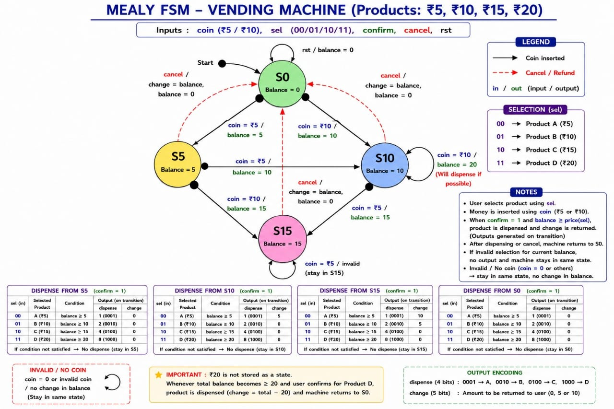
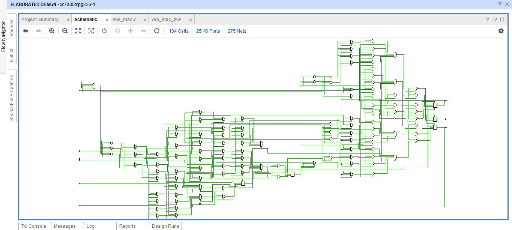
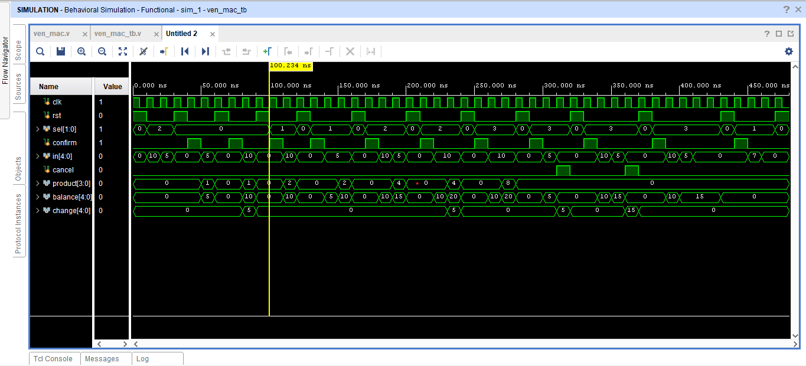

# Mealy FSM Based Multi-Product Vending Machine

A Mealy Finite State Machine (FSM) based multi-product vending machine controller designed using **Verilog HDL** and functionally verified using **Xilinx Vivado**.

## Features

- Mealy FSM based controller
- Supports four products (₹5, ₹10, ₹15 and ₹20)
- Accepts ₹5 and ₹10 coin denominations
- Product confirmation before transaction processing
- Automatic change calculation
- Transaction cancellation with balance refund
- RTL schematic generation
- Functional verification using Xilinx Vivado

## Project Outputs

### Mealy FSM Design

### RTL Schematic

### Behavioral Simulation

## Documentation

The complete project report, including the design methodology, FSM design, RTL architecture, verification strategy, and simulation results, is available in this repository.

> **Note:** The Verilog source code is intentionally not included to protect the original implementation while showcasing the project design and verification results.

## Tools Used

- Verilog HDL
- Xilinx Vivado

## Author

**Priya Nageswari Karanam**
